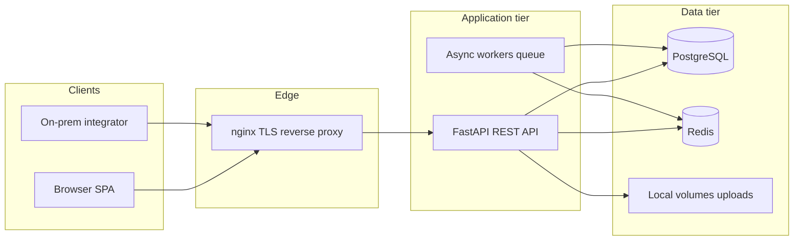

# MeritForge — Design Document

**Version:** 1.0  
**Last updated:** March 28, 2026  
**Related:** [Product prompt](../metadata.json) (`prompt` field) · [Questions & resolutions](./questions.md) · [API specification](./api-spec.md) · [prompt mirror](../prompt.md)

---

## 1. Purpose and scope

This document describes the technical and product design for **MeritForge**, a career media and hiring platform intended for **offline-ready / intranet-first** deployment. It consolidates architecture, major domain concepts, cross-cutting policies, and operational expectations so implementers and reviewers share one source of truth.

**In scope:** Role-based web workspaces, content lifecycle (authoring → review → publishing), student media consumption and progress, employer job flows, governance (risk, audit, step-up), operations metrics, and on-prem integration patterns (REST, webhooks).

**Out of scope for this document:** Line-by-line API paths (see `api-spec.md` and generated OpenAPI), detailed UI mockups, and low-level database DDL (see migrations and models in the repo).

---

## 2. Goals and principles

| Goal | Design implication |
|------|-------------------|
| Single site for students, employers, authors, reviewers, and admins | One Vue SPA with **role-based routing and workspaces**, backed by unified APIs |
| Offline-ready operation | No dependency on external SaaS for core flows; **PostgreSQL** as system of record; assets and uploads on local/volume storage |
| Rigorous governance | Configurable **review workflow**, **risk grading**, **audit logs**, **step-up** for sensitive actions |
| Measurable outcomes | **Operations dashboard** with KPIs and **permissioned CSV export** |
| Safe integrations | **HMAC-signed webhooks**, **idempotency**, **rate limits**, async delivery with **retries and dead-letter** |

**Principles:** Enforce business rules on the server (FastAPI); validate all inputs; prefer deterministic, auditable behavior over opaque automation; keep privacy defaults strict (private annotations unless explicitly shared).

---

## 3. Personas and roles

The product prompt defines these **primary roles**. Each maps to RBAC in the backend and differentiated UI shells in the frontend.

| Role | Primary goals |
|------|----------------|
| **Student** | Discover content (video, articles), favorites, search, topic subscriptions, bookshelf, bookmarks, annotations, employment **milestones** |
| **Employer manager** | Job posts, application tracking, milestone templates where applicable |
| **Content author** | Submit articles, videos, job announcements into **review**; respond to revision requests |
| **Reviewer** | Move submissions through **initial / secondary / final** (or configured) stages; return for revision with **required reason (≥ 20 characters)** |
| **System administrator** | Users, roles, compliance dictionary, publishing policy, exports, audit visibility, webhooks, keys |

**Reviewer eligibility (resolved):** Users with **Reviewer** or **System Administrator** may act as reviewers, subject to workflow assignment rules.

---

## 4. System context

- **Browser:** Vue 3 SPA over **HTTPS** (local or org-issued certificates in production).
- **Integrator:** Same origin or intranet callers using REST; **webhooks** for outbound events.
- **nginx:** Terminates TLS and proxies to frontend and API (see repo `docker-compose` layout).

---

## 5. Logical architecture

### 5.1 Frontend

- **Vue 3**, **Vite**, **TypeScript**, **Pinia**, **Vue Router**, **Tailwind CSS** (per stack resolution in `questions.md`).
- **Offline-ready SPA:** Core flows assume network to **local** API only; no third-party analytics or auth providers required for baseline operation.
- **Workspaces:** Distinct navigation and feature sets per role; shared components for content playback, status banners, and audit-sensitive confirmations.

### 5.2 Backend

- **FastAPI** exposing REST-style resources consumed by the SPA.
- **SQLAlchemy 2.x** + **Alembic** for persistence and migrations.
- **Pydantic v2** for request/response validation and settings.
- **Background processing:** **Celery** (or equivalent) backed by **Redis** for scheduled publishing, webhook delivery, retries, and dead-letter handling.

### 5.3 Data store

- **PostgreSQL** holds users, roles, content **versions**, review decisions, telemetry events (play / skip / favorite / search), jobs, applications, student progress, publishing history, webhook state, and audit entries.
- **Redis:** Broker/cache for async jobs and rate-limit backing where applicable.

### 5.4 Deployment (reference)

Containerized stack: **nginx**, **frontend**, **backend**, **db**, **redis** (optional profiles for dev tools and tests). Runbook paths live in `repo/meritforge/README.md`.

---

## 6. Domain overview

### 6.1 Content and versions

- Content types include **articles**, **videos**, and **job announcements** (as submissions).
- Each logical content item supports **versioning** so review comments, risk snapshots, and publishing records remain traceable.

### 6.2 Review workflow

- **Configurable stages** (e.g. initial, secondary, final): count and required approvers are admin-configurable.
- **Sequential by default**; **parallel assignment** supported where modeled for secondary review.
- **Return for revision:** One-click action with **mandatory reason**, minimum **20 characters**; status returns to a revision state for the author.
- **Status visibility:** Submissions show a **clear status banner**, reviewer feedback, and history appropriate to the viewer’s role.

### 6.3 Risk and compliance

- **Administrator-managed** dictionary: keywords, phrases, and **regex** patterns (offline-appropriate; no external ML dependency).
- **Scoring:** Weighted matches produce **Low / Medium / High** risk grades.
- **Policy:**
  - **High:** Blocked from publishing until **final approval** path satisfied (including elevated reviewer/admin rules as implemented).
  - **Medium:** Requires **at least two distinct reviewer** approvals before publish eligibility.
- **Transparency:** Log which rules or terms contributed (for reviewer context), without exposing raw dictionary unnecessarily to end users.

### 6.4 Publishing

- **Scheduling:** Publish at a defined datetime (e.g. `03/25/2026 9:00 AM` local/server policy).
- **Canary:** Configurable **percentage** and **duration** (default narrative: **5% for 2 hours**). Assignment must be **deterministic and auditable** (e.g. user id hash modulo 100, or explicit cohort flag), then auto-promote or rollback per policy.
- **Takedown:** Immediate visibility change with a **retraction notice**; full **publishing record** retained.
- **Traceability:** Every publish/schedule/canary/takedown change append to an immutable-style **publishing history** (who/when/what changed).

### 6.5 Student experience

- **Media:** Short career videos with play/skip; **favorites**; **search**; **topic subscriptions**.
- **Progress:** Resume per content item; conflicts resolved by **“latest update wins”** per item at the server, with **annotation revision history** preserved separately.
- **Book shelf / bookmarks / highlights:** Default **private**; optional sharing to a **cohort** (admin-defined or user groups per `questions.md`).
- **Milestones:** Employment progress (e.g. resume approved → offer accepted)—**predefined templates** plus **custom** milestones where allowed; updates **manual** (student self-report and employer verification) with in-app notifications.

### 6.6 Employer and hiring

- **Job posts** and **application** tracking tied to employer context.
- Funnel metrics feed the operations dashboard (see §8).

---

## 7. Security and privacy

### 7.1 Authentication and session

- **Local credentials** (username/password); **JWT** in **HttpOnly cookies** over HTTPS (no external IdP required for baseline).
- **Step-up authentication:** Re-enter password for **permission changes**, **takedowns**, and **account deletions**.

### 7.2 Authorization

- **RBAC** enforced in API layers; UI hiding is not sufficient for security.
- **Rate limiting:** Default **120 requests/minute per user** (configurable); apply consistently to mutating and sensitive read endpoints.

### 7.3 Data protection

- **Passwords and tokens:** Encrypted at rest; **central key management** on server with **rotation every 180 days** (configurable).
- **Privacy scopes:** Consent-based visibility for **contact info** and **photos**.
- **Data subject rights:** **Downloadable export** generated locally; **hard delete within 30 days** of request unless legally retained.

### 7.4 Audit

- Capture **who**, **what**, **when**, **IP** (from trusted forward headers behind nginx), and **before/after** for sensitive mutations.
- **Retention:** **365 days** default, searchable; automated purge job per policy.

---

## 8. Operations and analytics

- **Dashboard:** Trending content, **retention** and **conversion** KPIs, **job post → application** funnel.
- **Exports:** **CSV** for local reporting; **permission-gated** (ops/admin roles).
- All metrics should be computable from **local** warehouse tables (PostgreSQL); no external BI requirement for core delivery.

---

## 9. Integrations

- **OpenAPI:** Exposed alongside FastAPI (e.g. `/docs`) for intranet consumers; formal contract also summarized in `api-spec.md`.
- **Webhooks:** Outbound to **on-prem URLs only** (policy); **HMAC** signatures, **idempotency keys** for creates/updates, **retry** with **dead-letter** queue for failed deliveries.

---

## 10. Cross-cutting technical policies

| Concern | Policy |
|---------|--------|
| Input validation | Pydantic + explicit business validators in services |
| Concurrency | Progress merges deterministic; document edge cases in API tests |
| File uploads | Local volumes; virus scanning optional for intranet policy |
| Time zones | Document server vs user display; scheduling uses consistent canonical time |
| Context length / long sessions | For AI-assisted development, continue in new chat when traces approach limits; store pointers in `../sessions/` |

---

## 11. Traceability

| Artifact | Location |
|----------|----------|
| Product requirements | `../metadata.json` → **`prompt`** (same text mirrored in `../prompt.md` for editing) |
| Resolved ambiguities | `./questions.md` |
| HTTP contract | `./api-spec.md` + generated OpenAPI in running backend |
| Runnable system | `../repo/meritforge` |

---

## 12. Revision history

| Version | Date | Notes |
|---------|------|--------|
| 1.0 | 2026-03-28 | Initial full design doc from prompt + questions log + repo README |
